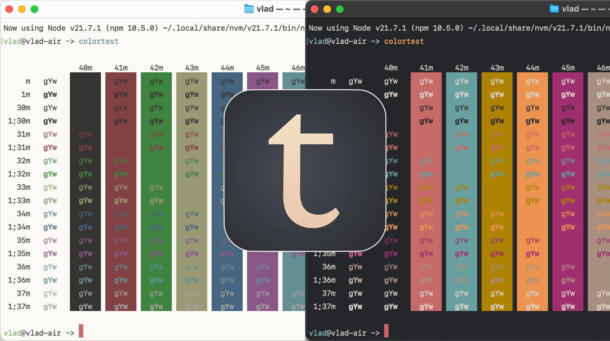

## Tiniri theme for MacOS Terminal

Part of Tiniri set. Download other themes and wallpapers:

[tiniri.vlad.studio](https://tiniri.vlad.studio/)

---

To install:

- download `terminal` files (right-click and Save As...):
  - [Tiniri (Dark).cottheme](https://raw.githubusercontent.com/vladstudio/tiniri-terminal/main/Tinir-Dark.terminal)
  - [Tiniri (Light).cottheme](https://raw.githubusercontent.com/vladstudio/tiniri-terminal/main/Tinir-Light.terminal)
- open Terminal
- open Settings
- select Profiles, click ... button next on bottom, select Import
- enjoy :-)